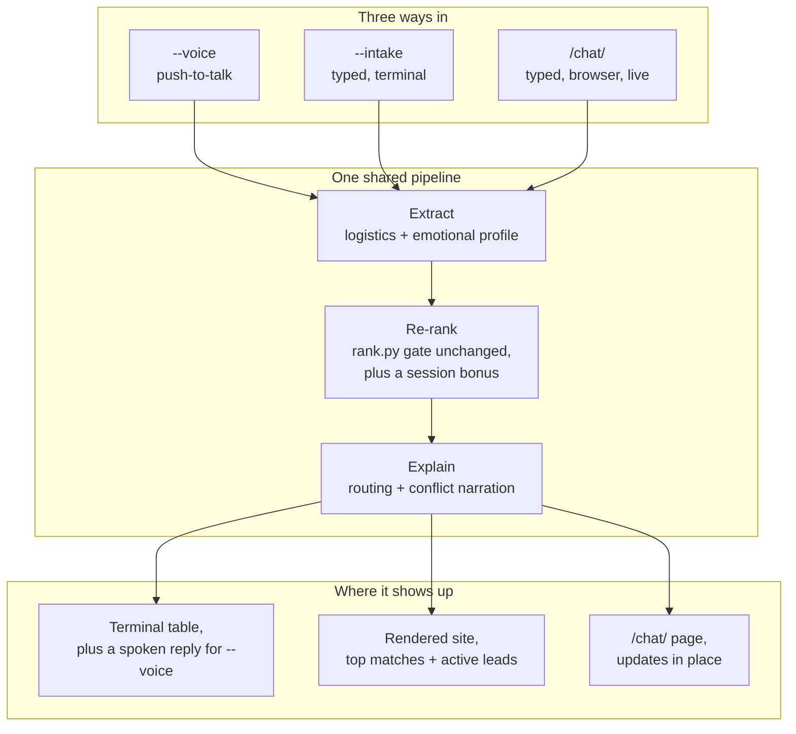

# Casita

A personal rental search tool for a household with two large dogs, published as-is for an interview loop.

## Demo

The base demo needs no credentials. It runs off a sanitized SQLite fixture with cached route times and precomputed rankings already baked in.

```bash
uv sync
uv run playwright install chromium
uv run casita demo
```

Open <http://127.0.0.1:8765/>.

To try the conversational agent:

```bash
uv run casita demo --intake   # type what you want, no credentials needed
uv run casita demo --voice    # say what you want, needs Gemini credentials and a mic
```

`/chat/` is also live on the running demo site. No flag needed, just click "chat" on the page.

## What it does

- Scrapes active listings from Zillow, Craigslist, Zumper, and Redfin.
- Normalizes everything into one SQLite schema.
- Uses Gemini to extract facts, review photos, write share blurbs, and rank listings.
- Computes walking and driving times to curated SF and Marin anchors: trails, beaches, bakeries.
- Renders a static site with an index page and a detail page per listing.
- Tracks up and down votes so a human can review revealed preference and hand-edit the ranking policy.
- Talks or types with you about what you want (voice, typed terminal, or live browser chat) and reorders the listings around it for that session.

## Architecture



Three input modes feed the same extraction, re-rank, and explain pipeline. What you get back depends on how you talked to it: a printed table and a spoken reply for `--voice`, a re-rendered page for `--voice`/`--intake`, or a live-updating page for `/chat/`.

## Voice mode

`casita demo --voice` is a real voice conversation, not text input with a voice wrapper on top. Here's what happens on each turn:

1. Press Enter, say what you want, press Enter again to stop. This is push-to-talk, not always-on listening. It keeps the turn boundary explicit and needs no voice activity detection.
2. The recorded audio, plus a text summary of everything said in earlier turns, goes to Gemini in one multimodal call. Gemini transcribes the audio and extracts a structured preference profile (dog policy, laundry, parking, minimum beds, and how the person wants the place to feel) in that same call. There's no separate speech-to-text step.
3. The listings get re-ranked using that profile, layered on top of the existing scoring (see "How it works" below).
4. Gemini writes a short spoken reply grounded in the ranked results, then speaks it back using its own native audio output. No separate text-to-speech vendor.
5. The conversation keeps going until one of four things happens: a turn comes back silent, you say something like "that's all" or "stop", the model decides it already has enough to work with, or fifteen minutes pass.

The first turn asks a specific opening question (beds, parking, laundry, trail or beach access, how you want it to feel) instead of an open "tell me about yourself," since the extraction schema is fixed and the question should point straight at it.

## How it works

Ranking already had two layers before this feature: a scoring function with fixed constants (`rank.py`), and an LLM ranking pass using a big prompt written around one household's preferences (`llm.py`). Neither of those changed.

The conversational agent adds a third layer that only runs for the current session: extract what was said, add it as a bonus on top of the existing score, and never let it override the hard gate. A listing with no dogs allowed is still a hard no, no matter how well it otherwise matches what someone said about wanting good light.

The agent also respects the same priority the rest of the site already uses. A listing already declined by a landlord, or one actively being pursued in the CRM pipeline, keeps that status no matter what gets said in one conversation. A stated preference can move things around inside a tier. It can't rescue a dead lead or bury an active one.

More detail lives in [`docs/how-it-works/preferences.md`](docs/how-it-works/preferences.md) and the full build history in [`docs/build-log.md`](docs/build-log.md).

## Tech stack

- Python and Click for the CLI
- SQLite for storage, no external database
- Pydantic for structured LLM outputs: preference profiles, extracted facts, rankings
- Gemini via Vertex AI for extraction, ranking, photo review, and voice
- `sounddevice` for local mic capture and playback in `--voice`
- Playwright for scraping and rendering Open Graph preview images
- Static HTML, CSS, and JS for the site, no frontend framework
- Google Maps Routes API for live route times, with a cached offline fallback

## Environment setup

The base demo needs nothing. `uv run casita demo` runs off a committed fixture and never calls a live API.

For live search, ranking, or the conversational agent with real Gemini:

```bash
cp .env.example .env
```

Then fill in what you need:

- `CASITA_GCP_PROJECT`: a GCP project with Vertex AI enabled
- `CASITA_VOICE_MODEL`: model used for `--voice`'s transcription and replies, defaults to a fast one
- `GOOGLE_MAPS_API_KEY`: optional, only needed for live route calculations

The rest of the variables are documented inline in `.env.example`.

You'll also need to run `gcloud auth application-default login` once, so the Gemini client has something to authenticate with.
